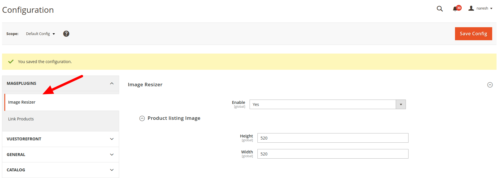

# Resize Image GraphQl

`ResizeImageGraphQl` is a Magento 2 module developed by `Mageplugins` that enables dynamic resizing of product images via GraphQL queries.

## Features

- **Dynamic Image Resizing**: Resize product images directly through GraphQL queries.
- **Configurable Dimensions**: Easily configure the width and height for image resizing.
- **Seamless Integration**: Integrates smoothly with existing Magento 2 setups.

## Installation

### Option 1: Manual Installation

1. Create the necessary directory structure inside your Magento `code` directory:

    ```bash
    mkdir -p app/code/Mageplugins
    ```

2. Clone the extension into this directory:

    ```bash
    git clone https://github.com/ccyogendra/imageresizer.git
    ```

3. Rename the cloned folder:

    ```bash
    mv app/code/Mageplugins/imageresizer app/code/Mageplugins/ResizeImageGraphQl
    ```
Or Manually   
Directory rename folder imageresizer to ResizeImageGraphQl

# Enable the Module
```Bash
php bin/magento module:enable Mageplugins_ResizeImageGraphQl
php bin/magento setup:upgrade
```


# Clear Cache
```Bash
php bin/magento cache:clean
php bin/magento cache:flush
```


## Admin Configuration
Navigate to Stores > Configuration > Mageplugins > Image Resizer.
Configure the settings according to your preferences.
set width and heght according to need


# Basic Query
Test the image resizing functionality using the following GraphQL query:

```Bash
{
  products(filter: { sku: { eq: "ABC123" } }) {
    items {
      name
      sku
      url_key
      stock_status
      image {
        url
      } 
        
      price_range {
        minimum_price {
          regular_price {
            value
            currency
          }
        }
      }
    }
    total_count
    page_info {
      page_size
    }
  }
}
```
# Custom query 
For custom you can pass width and heigh from frontend graphQl 
```Bash

{
  products(filter: { sku: { eq: "ABC123" } }) {
    items {
      name
      sku
      url_key
      stock_status
      image {
        url(width: 200, height: 200)
      } 
        
      price_range {
        minimum_price {
          regular_price {
            value
            currency
          }
        }
      }
    }
    total_count
    page_info {
      page_size
    }
  }
}

```
